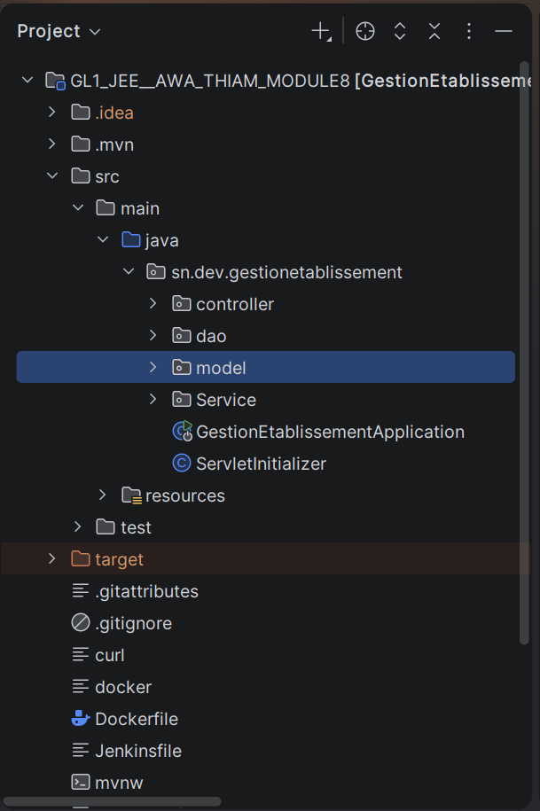

#  Gestion Établissement — Module 8 CI/CD

<p align="center">
  
  
  
  
  
  
  
    
  
  
  
</p>


> **Auteure :** Awa Thiam  
> **Formation :** GL1 – JEE / DevOps  
> **Module :** 8 – Intégration Continue & Déploiement Continu (CI/CD)  
> **Docker Hub :** `thiamawa/gl1-jee-module8`  
> **Port applicatif :** `8081`


## Description du projet

**Gestion Établissement** est une application web ** Spring Boot** permettant de gérer les entités d'un établissement scolaire (étudiants, inscrire, filières, Paiement, etc.).

Le projet intègre un pipeline CI/CD complet avec **Jenkins**, utilisant des agents Docker pour isoler chaque étape, et déploie automatiquement l'application sur un **serveur distant via SSH** après validation manuelle.


## Structure du projet


---

## 🔄 Pipeline CI/CD — Vue d'ensemble

```
 ┌───────────────┐
 │  Push GitHub  │
 └──────┬────────┘
        │  webhook / polling
        ▼
 ┌───────────────────────────────────────────────────────────────┐
 │                     JENKINS PIPELINE                          │
 │                                                               │
 │  ┌────────────┐   ┌─────────────────┐   ┌─────────────────┐  │
 │  │ 🧪 Unit    │──▶│ 🐳 Build Docker │──▶│ 📤 Push Docker  │  │
 │  │   Test     │   │    Image        │   │    Hub          │  │
 │  │ (maven:    │   │ (docker:25.0.3) │   │ (docker:25.0.3) │  │
 │  │  alpine)   │   │ Multi-stage     │   │ credentials     │  │
 │  └────────────┘   └─────────────────┘   └────────┬────────┘  │
 │                                                   │           │
 │                          ┌────────────────────────┘           │
 │                          ▼                                    │
 │                  ┌───────────────┐                            │
 │                  │ ✋ Approval   │  ← Validation manuelle     │
 │                  │  (input gate) │                            │
 │                  └───────┬───────┘                            │
 │                          │  approved                          │
 │                          ▼                                    │
 │                  ┌───────────────────┐                        │
 │                  │ 🚀 Deploy Remote  │                        │
 │                  │   SSH + Docker    │                        │
 │                  └───────────────────┘                        │
 │                                                               │
 │  post: ✅ success  |  ❌ failure  |  🔄 always               │
 └───────────────────────────────────────────────────────────────┘
        │
        ▼
 ┌─────────────────────────────────┐
 │  Serveur distant :8081          │
 │  container: gl1-jee-module8     │
 └─────────────────────────────────┘
```

---

## 🖼️ Captures d'écran Jenkins

### Vue générale du pipeline
> *Ajoutez votre capture après le premier build réussi*


---

### Pipeline Blue Ocean — Stages
> *Vue graphique des 5 stages avec statuts*


---

### Résultats des tests JUnit
> *Rapport généré automatiquement par le stage Unit Test*


---

### Image publiée sur Docker Hub
> *Tag versionné : `thiamawa/gl1-jee-module8:v<BUILD_NUMBER>`*


---

### Déploiement SSH — Serveur distant
> *Logs du déploiement sur le serveur remote via SSH*


---

## ⚙️ Fichier `Jenkinsfile`

Le pipeline est **déclaratif**, sans agent global (`agent none`), chaque stage déclare son propre agent Docker pour une isolation maximale.

```groovy
pipeline {
    agent none

    environment {
        IMAGE          = "thiamawa/gl1-jee-module8"
        REMOTE_USER    = "user"
        REMOTE_HOST    = "remote.server.com"
        CONTAINER_NAME = "gl1-jee-module8"
        APP_PORT       = "8081"
    }

    stages {

        // ─────────────────────────────────────────────────
        // STAGE 1 — Tests unitaires (agent Maven Alpine)
        // ─────────────────────────────────────────────────
        stage('Unit Test') {
            agent {
                docker {
                    image 'maven:3.9.11-eclipse-temurin-17-alpine'
                    args  '-u root -v $HOME/.m2:/root/.m2'
                }
            }
            steps {
                sh 'mvn test'
            }
            post {
                always {
                    junit '**/target/surefire-reports/*.xml'
                }
            }
        }

        // ─────────────────────────────────────────────────
        // STAGE 2 — Build image Docker (multi-stage)
        // Maven tourne dans le Dockerfile, pas ici
        // ─────────────────────────────────────────────────
        stage('Build Docker Image') {
            agent {
                docker {
                    image 'docker:25.0.3'
                    args  '-u root -v /var/run/docker.sock:/var/run/docker.sock'
                }
            }
            steps {
                sh "docker build -t ${IMAGE}:v${BUILD_NUMBER} ."
            }
        }

        // ─────────────────────────────────────────────────
        // STAGE 3 — Push vers Docker Hub
        // ─────────────────────────────────────────────────
        stage('Push to Docker Hub') {
            agent {
                docker {
                    image 'docker:25.0.3'
                    args  '-u root -v /var/run/docker.sock:/var/run/docker.sock'
                }
            }
            steps {
                withCredentials([usernamePassword(
                    credentialsId: 'dockerhub_credentials',
                    usernameVariable: 'DOCKER_HUB_USERNAME',
                    passwordVariable: 'DOCKER_HUB_PASSWORD'
                )]) {
                    sh """
                        echo "\$DOCKER_HUB_PASSWORD" | docker login -u "\$DOCKER_HUB_USERNAME" --password-stdin
                        docker push ${IMAGE}:v${BUILD_NUMBER}
                        docker logout
                    """
                }
            }
        }

        // ─────────────────────────────────────────────────
        // STAGE 4 — Validation manuelle (gate humain)
        // ─────────────────────────────────────────────────
        stage('Approval') {
            agent none
            steps {
                input message: 'Voulez-vous déployer sur le serveur distant ?',
                      ok: 'Déployer'
            }
        }

        // ─────────────────────────────────────────────────
        // STAGE 5 — Déploiement SSH sur serveur distant
        // ─────────────────────────────────────────────────
        stage('Deploy on Remote Server') {
            agent any
            steps {
                sshagent(credentials: ['ssh-remote-server']) {
                    sh """
                        ssh -o StrictHostKeyChecking=no ${REMOTE_USER}@${REMOTE_HOST} '
                            docker pull ${IMAGE}:v${BUILD_NUMBER} &&
                            docker stop  ${CONTAINER_NAME} || true &&
                            docker rm    ${CONTAINER_NAME} || true &&
                            docker run -d \\
                                --name ${CONTAINER_NAME} \\
                                -p ${APP_PORT}:${APP_PORT} \\
                                ${IMAGE}:v${BUILD_NUMBER}
                        '
                    """
                }
            }
        }
    }

    post {
        success {
            echo "✅ Pipeline réussi — Image déployée : ${IMAGE}:v${BUILD_NUMBER}"
        }
        failure {
            echo '❌ Pipeline échoué — Vérifier les logs ci-dessus'
        }
        always {
            echo 'Pipeline terminé.'
        }
    }
}
```

---

## 🚦 Description des 5 stages

| # | Stage | Agent Docker | Action principale | Particularité |
|---|-------|-------------|-------------------|---------------|
| 1 | **🧪 Unit Test** | `maven:3.9.11-eclipse-temurin-17-alpine` | `mvn test` + rapport JUnit | Cache `.m2` monté en volume |
| 2 | **🐳 Build Docker Image** | `docker:25.0.3` | `docker build -t IMAGE:vN .` | Socket Docker partagé |
| 3 | **📤 Push to Docker Hub** | `docker:25.0.3` | `docker push IMAGE:vN` | Credentials Jenkins `dockerhub_credentials` |
| 4 | **✋ Approval** | `none` | Gate de validation manuelle | Bloque le pipeline jusqu'à approbation humaine |
| 5 | **🚀 Deploy on Remote Server** | `any` | `ssh` → pull + stop + run | Credentials SSH `ssh-remote-server` |

---

## 🐳 Dockerfile multi-stage

Le Dockerfile suit un pattern **multi-stage** pour produire une image de production légère et sécurisée.

```dockerfile
# ─────────────────────────────────────────────
# STAGE 1 : Compilation Maven
# ─────────────────────────────────────────────
FROM maven:3.9.11-eclipse-temurin-17-alpine AS builder

WORKDIR /build

# Cache des dépendances Maven
COPY pom.xml .
RUN mvn dependency:go-offline -q

# Compilation
COPY src ./src
RUN mvn clean package -DskipTests -q

# ─────────────────────────────────────────────
# STAGE 2 : Image de production (légère)
# ─────────────────────────────────────────────
FROM eclipse-temurin:17-jre-alpine AS production

WORKDIR /app

# Utilisateur non-root pour la sécurité
RUN addgroup -S appgroup && adduser -S appuser -G appgroup

# Copie uniquement le WAR final
COPY --from=builder /build/target/*.war app.war

RUN chown appuser:appgroup app.war

USER appuser

EXPOSE 8081

ENTRYPOINT ["java", "-jar", "app.war"]
```

### Avantages du multi-stage

| Aspect | Bénéfice |
|--------|----------|
| **Taille** | L'image finale ne contient que le JRE + le WAR (sans Maven ni sources) |
| **Sécurité** | Exécution en utilisateur non-root `appuser` |
| **Cache** | `pom.xml` copié séparément pour réutiliser le cache des dépendances Maven |
| **Propreté** | Aucun outil de build dans l'image de production |

---

## 🔐 Credentials Jenkins requis

Avant de lancer le pipeline, configurer les deux credentials suivants dans Jenkins :

| ID Jenkins | Type | Usage |
|------------|------|-------|
| `dockerhub_credentials` | Username / Password | Login Docker Hub pour le push de l'image |
| `ssh-remote-server` | SSH Username with private key | Connexion SSH au serveur de déploiement |

> **Chemin Jenkins :** `Tableau de bord → Manage Jenkins → Credentials → Global → Add Credentials`

---

## 🚀 Mise en route locale

### Prérequis

- Java 17+ installé
- Maven 3.9+ installé
- PostgreSQL 16 installé et démarré
- Docker installé
- Jenkins LTS avec les plugins : `Docker Pipeline`, `SSH Agent`, `JUnit`, `Blue Ocean`

### 1. Cloner le projet

```bash
git clone https://github.com/thiamawa/gestionEtablissement.git
cd gestionEtablissement
```

### 2. Configurer la base de données

```properties
# src/main/resources/application.properties
spring.datasource.url=jdbc:postgresql://localhost:5432/gestion_etablissement_db
spring.datasource.username=postgres
spring.datasource.password=votre_mot_de_passe
spring.jpa.hibernate.ddl-auto=update
server.port=8081
```

### 3. Lancer en local

```bash
mvn spring-boot:run
```

Application : `http://localhost:8081`  
Swagger UI : `http://localhost:8081/swagger-ui/index.html`

### 4. Construire et lancer avec Docker

```bash
# Build
docker build -t thiamawa/gl1-jee-module8:latest .

# Run
docker run -d \
  --name gl1-jee-module8 \
  -p 8081:8081 \
  thiamawa/gl1-jee-module8:latest
```

### 5. Lancer depuis Docker Hub

```bash
docker pull thiamawa/gl1-jee-module8:v<BUILD_NUMBER>
docker run -d --name gl1-jee-module8 -p 8081:8081 thiamawa/gl1-jee-module8:v<BUILD_NUMBER>
```

---

## 🔧 Configuration Jenkins — Pas à pas

1. **Nouveau Item** → choisir **Pipeline** → nommer `GestionEtablissement`
2. **Pipeline** → `Pipeline script from SCM`
3. **SCM** → `Git` → renseigner l'URL du dépôt
4. **Script Path** → `Jenkinsfile`
5. Ajouter les credentials `dockerhub_credentials` et `ssh-remote-server`
6. Sauvegarder → **Build Now**

---

## ✅ Bonnes pratiques appliquées

- `agent none` global → chaque stage déclare son propre agent Docker
- Cache Maven `.m2` monté en volume pour accélérer les builds
- Credentials Jenkins pour Docker Hub et SSH (aucun mot de passe en clair)
- Gate de validation manuelle (`input`) avant déploiement en production
- Dockerfile multi-stage pour une image légère et sécurisée
- Exécution en utilisateur non-root dans le conteneur (`appuser`)
- Image versionnée avec `BUILD_NUMBER` pour la traçabilité
- Stop/remove de l'ancien conteneur avant redéploiement

---

## 👩‍💻 Auteure

**Awa Thiam**  
Étudiante en Génie Logiciel – GL1  
Formation DevOps · JEE · Module 8  
Groupe ISI

---

## 📄 Licence

Ce projet est réalisé dans un cadre pédagogique.  
© 2024 – Awa Thiam · GL1 JEE DevOps · Groupe ISI
